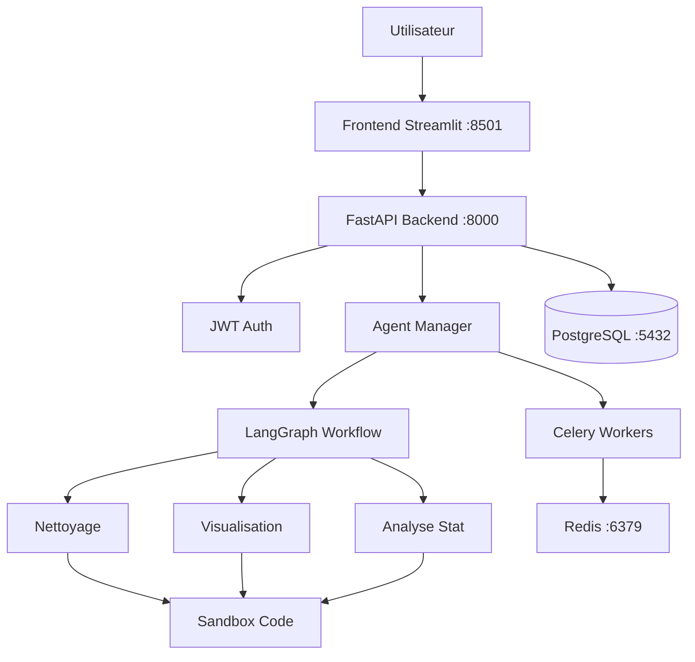

# DataStream AI - Plateforme d'Analyse de Donnees Agentique

Plateforme SaaS d'analyse de donnees automatisee utilisant un agent IA (LangGraph + GPT-4o) avec une architecture microservices prete pour la production.

## Architecture



## Fonctionnalites

- **Authentification JWT** : Inscription, connexion, isolation des donnees par utilisateur
- **Sessions persistantes** : Historique de conversation sauvegarde en PostgreSQL, survit aux redemarrages
- **Agent d'analyse** : 3 outils specialises (nettoyage, visualisation, analyse statistique)
- **Execution securisee** : Sandbox avec modules en liste blanche, blocage des imports dangereux
- **Visualisations persistantes** : Figures Plotly stockees en JSON dans la base de donnees
- **Taches asynchrones** : Celery Workers pour les analyses longues
- **Observabilite** : Health checks, logging structure, metriques

## Demarrage Rapide

```bash
# 1. Cloner le depot
git clone <url>
cd AgenticDataAnalysis-Exam

# 2. Configurer l'environnement
cp .env.example .env
# Editer .env avec votre cle OpenAI

# 3. Demarrer tous les services
docker-compose up -d

# 4. Verifier
docker-compose ps
```

## Acces

| Service | URL |
|---------|-----|
| Frontend | http://localhost:8501 |
| API Backend | http://localhost:8000 |
| Documentation API | http://localhost:8000/docs |
| Monitoring Celery | http://localhost:5555 |

## Structure du Projet

```
AgenticDataAnalysis-Exam/
├── backend/
│   ├── api/          # FastAPI (main, auth, routes, dependencies)
│   ├── db/           # SQLAlchemy (models, database, schemas)
│   ├── agents/       # LangGraph (agent_manager, tools, nodes)
│   ├── security/     # Sandbox d'execution de code
│   ├── tasks/        # Celery workers
│   └── tests/        # Tests pytest
├── frontend/
│   ├── app.py        # Point d'entree Streamlit
│   └── utils/        # Client API
├── infrastructure/
│   └── docker/       # Dockerfiles
├── alembic/          # Migrations base de donnees
├── docs/             # Documentation
├── docker-compose.yml
└── .env.example
```

## Tests

```bash
# Avec Docker
docker-compose exec backend pytest -v

# En local
pytest backend/tests/ -v --cov=backend --cov-report=term
```

## Documentation

- [Analyse d'Architecture](docs/ARCHITECTURE_ANALYSIS.md) - Audit du POC et decisions techniques
- [Guide d'Installation](docs/SETUP.md) - Instructions completes de deploiement
- [Documentation API](docs/API.md) - Specification des endpoints

## Stack Technique

| Composant | Technologie |
|-----------|------------|
| Backend API | FastAPI |
| Frontend | Streamlit |
| Base de donnees | PostgreSQL 15 |
| Cache / Broker | Redis 7 |
| Agent IA | LangGraph + GPT-4o |
| Taches async | Celery |
| Auth | JWT (python-jose + bcrypt) |
| ORM | SQLAlchemy 2.0 |
| Migrations | Alembic |
| Conteneurisation | Docker Compose |
| Tests | pytest (couverture >= 70%) |
