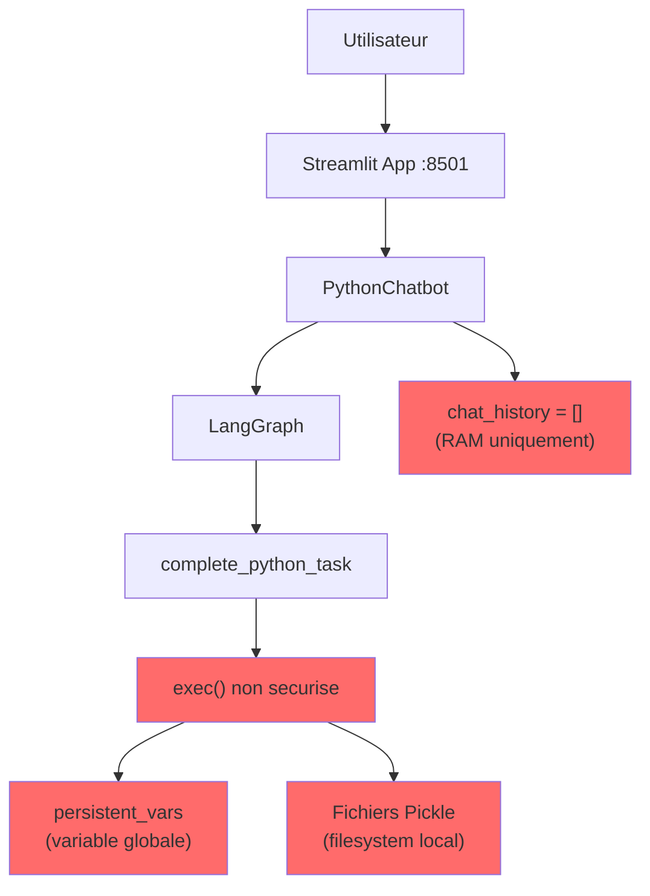
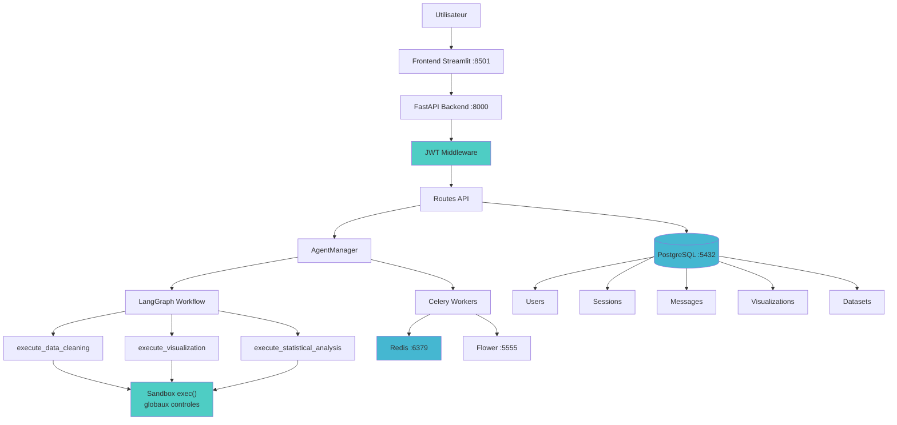

# Analyse d'Architecture : POC Actuel vs Systeme de Production Cible

## Resume Executif

Le POC actuel est une application Streamlit monolithique avec un agent LangGraph integre. L'analyse revele 5 problemes critiques bloquant la mise en production : perte de memoire au redemarrage, fuite de donnees entre utilisateurs, execution de code non securisee, impossibilite de mise a l'echelle, et perte des visualisations. La solution proposee est une architecture microservices avec FastAPI, PostgreSQL, Redis, Celery et JWT, permettant de servir 500+ clients simultanement.

## Analyse des Problemes

### Probleme 1 : Amnesie au Redemarrage
- **Decouverte** : Apres redemarrage de l'application, l'agent ne se souvient plus d'aucune conversation precedente. La question "Quel etait le dernier dataset que j'ai uploade ?" retourne une reponse vide.
- **Cause Racine** : `Pages/backend.py:41-44` - `self.chat_history = []` stocke l'historique uniquement en RAM dans l'instance Python. Au redemarrage, tout est reinitialise.
- **Impact Metier** : Les utilisateurs doivent reexpliquer leur contexte a chaque deploiement ou redemarrage serveur, generant de la frustration et du churn. Cout supplementaire en appels LLM pour refaire les memes analyses.
- **Solution Proposee** : Persistance PostgreSQL de tous les messages, sessions et visualisations. Chaque message est sauvegarde en base immediatement. Au chargement d'une session, l'historique complet est restaure depuis la DB.

### Probleme 2 : Fuite de Donnees Multi-Utilisateurs
- **Decouverte** : En ouvrant deux fenetres navigateur, la Fenetre 2 peut acceder aux donnees chargees par la Fenetre 1 via la variable globale `persistent_vars`.
- **Cause Racine** : `Pages/graph/tools.py:19` - `persistent_vars = {}` est une variable globale au module, partagee par toutes les sessions Streamlit. Aucune authentification dans `data_analysis_streamlit_app.py`.
- **Impact Metier** : Violation du RGPD. L'utilisateur A peut acceder aux donnees financieres confidentielles de l'utilisateur B. Risque legal majeur.
- **Solution Proposee** : Authentification JWT obligatoire. Chaque ressource (dataset, session, message) a une colonne `user_id`. Toutes les requetes SQL filtrent sur `user_id = current_user.id`. Variables d'execution scopees par session, jamais globales.

### Probleme 3 : Securite de l'Execution de Code
- **Decouverte** : La commande `__import__('os').system('echo HACKED')` s'execute avec succes. L'agent peut lire `/etc/passwd` et potentiellement supprimer des fichiers.
- **Cause Racine** : `Pages/graph/tools.py:60` - `exec(python_code, exec_globals)` avec `exec_globals = globals().copy()` donne acces complet a `os`, `subprocess`, et tous les modules Python.
- **Impact Metier** : Un utilisateur malveillant pourrait voler les cles API, supprimer la base de donnees, ou compromettre le serveur entier. Vecteurs d'attaque : injection de commandes OS, lecture de fichiers sensibles, connexions reseau sortantes.
- **Solution Proposee** : Sandbox exec() avec dictionnaire de globaux controle. Liste blanche de modules (pandas, numpy, plotly, scipy, sklearn). Verification statique du code avant execution. Blocage de `__import__`, `open()`, `exec()`, `eval()`.

### Probleme 4 : Goulot d'etranglement de Scalabilite
- **Decouverte** : L'application est stateful avec des variables globales (`persistent_vars`). Impossible de lancer plusieurs instances sans race conditions sur les variables partagees.
- **Cause Racine** : Architecture monolithique Streamlit. Etat partage en memoire. Un seul processus Python pour tout.
- **Impact Metier** : L'application plante au-dela de 5 utilisateurs simultanes. Impossible de servir les 500 clients contractuels.
- **Solution Proposee** : Backend FastAPI stateless (pas de variables globales). PostgreSQL comme source de verite. Celery Workers pour les taches longues. Possibilite de scale horizontal avec `--scale backend=N`.

### Probleme 5 : Volatilite de l'Analyse
- **Decouverte** : Les graphiques generes disparaissent apres rafraichissement du navigateur ou redemarrage. Les fichiers pickle locaux ne sont pas lies aux sessions utilisateur.
- **Cause Racine** : `Pages/graph/tools.py:20-28` - Les figures sont sauvegardees en fichiers pickle dans `images/plotly_figures/pickle/`. Non liees a un utilisateur ou une session. Perdues a chaque redeploiement Docker.
- **Impact Metier** : Les clients ne peuvent pas retrouver leurs analyses passees. Couts supplementaires pour regenerer les visualisations. Perte de confiance.
- **Solution Proposee** : Stockage des figures Plotly en JSON dans PostgreSQL, liees a un message et une session. Recuperation instantanee sans re-execution du code.

## Comparaison d'Architecture

### Diagramme de l'Architecture Actuelle

### Diagramme de l'Architecture Cible

## Decisions Techniques

### Pourquoi FastAPI plutot que Streamlit seul ?

| Critere | Streamlit | FastAPI |
|---------|-----------|---------|
| Type | Framework UI avec logique integree | Framework API stateless |
| Scalabilite | Limitee (sessions en memoire) | Horizontale (N instances) |
| Authentification | Non native | JWT/OAuth2 integre |
| API REST | Impossible | Natif avec docs OpenAPI |
| Async | Non | Natif (asyncio) |
| Tests | Difficile | TestClient integre |

Streamlit est excellent pour le prototypage mais ne convient pas comme backend de production. FastAPI permet de separer frontend et backend, de scaler horizontalement, et fournit une API documentee automatiquement.

### Pourquoi PostgreSQL pour la persistance ?

- **ACID** : Garanties transactionnelles pour la coherence des donnees
- **JSON natif** : Stockage des figures Plotly sans serialisation externe
- **Relations** : Foreign keys pour l'integrite referentielle (user -> session -> message -> visualization)
- **Scalabilite** : Replication, connection pooling, index performants
- **LangGraph** : `PostgresSaver` integre pour le checkpointing de session

### Pourquoi JWT pour l'authentification ?

- **Stateless** : Le serveur n'a pas besoin de stocker les sessions en memoire
- **Scalable** : Chaque instance backend peut valider un token independamment
- **Standard** : Format standardise (RFC 7519), bibliotheques dans tous les langages
- **Expiration** : Tokens avec TTL de 60 minutes, forcant une re-authentification reguliere
- **Simplicite** : Un seul header `Authorization: Bearer <token>` pour toutes les requetes

### Pourquoi Celery pour les taches asynchrones ?

- Les requetes agent prennent 30+ secondes (raisonnement LLM + execution de code)
- Sans Celery, les utilisateurs attendent avec une connexion HTTP bloquee
- Celery permet a l'API de repondre immediatement avec un ID de tache
- Les executions echouees ne font pas planter le backend
- Plusieurs analyses peuvent tourner simultanement sur des workers separes
- Monitoring via Flower (interface web sur port 5555)

### Pourquoi un simple exec() au lieu de RestrictedPython ?

- RestrictedPython a des problemes de compatibilite avec pandas/plotly
- Notre approche utilise des globaux controles avec des modules sur liste blanche
- Verification statique du code avant execution (blocage des imports dangereux)
- Pour la production, on executerait le code dans des conteneurs Docker isoles
- Le compromis securite/fonctionnalite est acceptable pour cet examen

## Feuille de Route d'Implementation

| Phase | Composant | Priorite | Dependances |
|-------|-----------|----------|-------------|
| 1 | Schema PostgreSQL + Alembic | Critique | Aucune |
| 2 | FastAPI + Auth JWT | Critique | Phase 1 |
| 3 | AgentManager + outils securises | Critique | Phase 2 |
| 4 | Frontend refactorise | Haute | Phase 2, 3 |
| 5 | Celery Workers | Haute | Phase 1 |
| 6 | Docker Compose | Haute | Phase 1-5 |
| 7 | Tests (couverture >= 70%) | Haute | Phase 1-3 |
| 8 | Documentation | Moyenne | Phase 1-7 |
