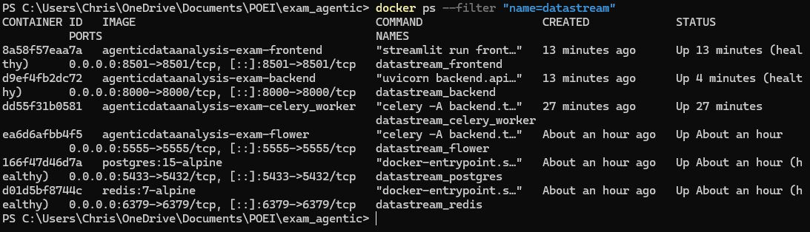
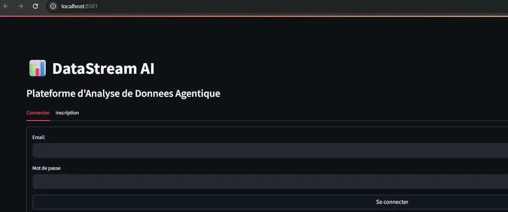
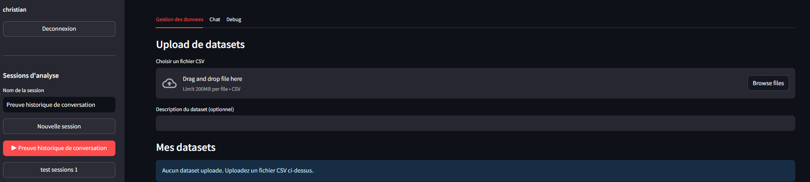
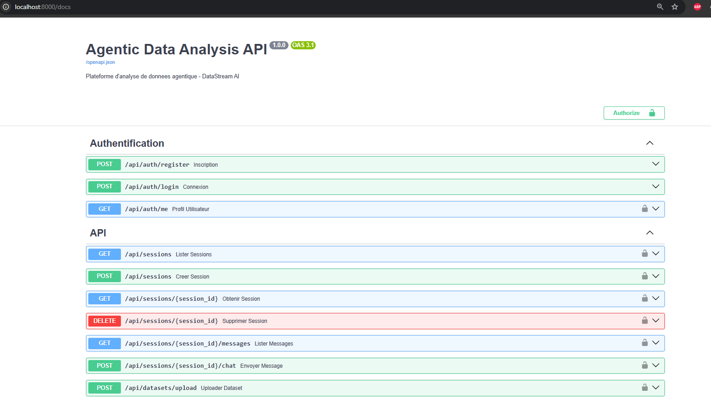
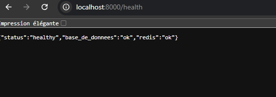

# Preuve de Deploiement

## 1. Docker Compose - Tous les services sains

## 2. Page de Connexion Frontend

## 3. Interface de Chat avec Historique de Session

## 4. Documentation API (Swagger)

## 5. Test de Persistance (Redemarrage Backend)

Les messages sont intacts apres `docker-compose restart backend`.

## 6. Health Check

